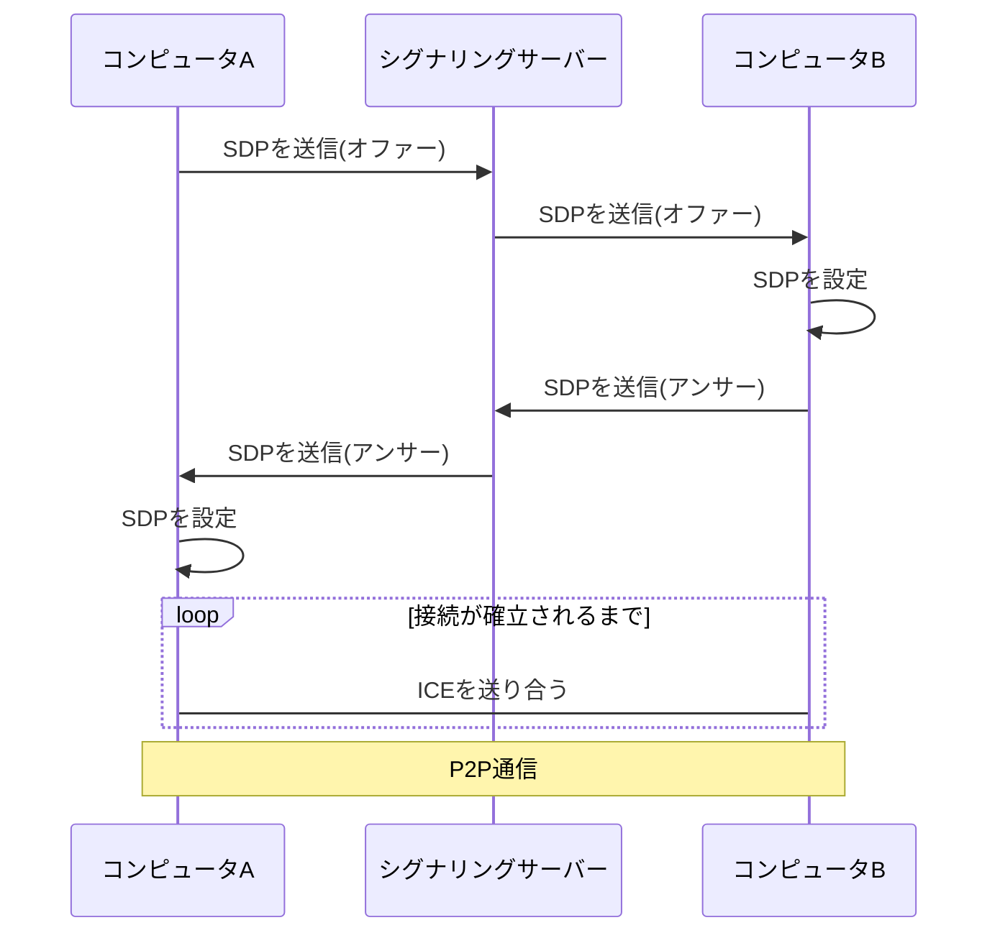

## WebRTC とは

WebRTC(Web Real-Time Communication)はブラウザでリアルタイム P2P 通信を行うための OSS プロジェクトです。現在ではほとんどのブラウザが実装済みであり、API を使うことによりビデオ通話やオンライン対戦ゲームを作ることができます。Google Meet や Zoom の Web 版などで利用されています。

https://webrtc.org/
https://developer.mozilla.org/en-US/docs/Web/API/WebRTC_API#guides
https://caniuse.com/?search=webrtc

P2P(Peer to Peer)通信とはコンピュータの通信を行う際の方式の一つです。クライアント・サーバー方式とは違い特別な役割を持つサーバーが存在せず接続されたコンピュータは対等な関係(Peer)でデータを交信します。Peer とは同等、同格の人などの意味があります。P2P 通信はサーバーの負荷がかからない、1 つのピアが停止してもサービス全体が停止することがないなどのメリットがあります。

https://ja.wikipedia.org/wiki/Peer_to_Peer

## WebRTC の構成要素

### Session Description Protocol (SDP)

SDP とは WebRTC で使われるプロトコルです。SDP は WebRTC で使われるネットワークとメディアの情報を表します。例えば、例えば通信プロトコル、エンドポイントの IP アドレスとポートなどが含まれます。ビデオ通話をするときにはビデオの解像度やコーデックの情報が SDP に追加されます。通信するコンピュータ同士で SPD を交換してお互いに使えるコーディックや通信プロトコルを決めます。

P2P 通信を始めたい場合は何らかの手段を使い相手に SDP を送る必要があります。これをオファーと言います。オファー（Offer）を受け取った側は 相手に自分の SDP を送り返します。これをアンサー（Answer）と言います。

SDP は以下のようなテキスト形式で表されます。

```
v=0
o=jdoe 3724394400 3724394405 IN IP4 198.51.100.1
s=Call to John Smith
i=SDP Offer #1
u=http://www.jdoe.example.com/home.html
e=Jane Doe <jane@jdoe.example.com>
p=+1 617 555-6011
c=IN IP4 198.51.100.1
t=0 0
m=audio 49170 RTP/AVP 0
m=audio 49180 RTP/AVP 0
m=video 51372 RTP/AVP 99
c=IN IP6 2001:db8::2
a=rtpmap:99 h263-1998/90000
```

https://datatracker.ietf.org/doc/html/rfc8866

### Interactive Connectivity Establishment (ICE)

SDP でビデオのコーディックは確定できました。
しかし SDP で指定されるアドレスとポート番号は NAT やファイアウォールによって変更される可能性があります。そのため、WebRTC では ICE というプロトコルを使って通信相手との通信に使えるアドレスとポート番号を探します。
ICE Gathering というプロセスで通信相手との通信に使える ICE を探します。ICE はあくまで候補なため確実に通信できるとは限りません。通信相手との通信が確立するまでに複数の候補を試す必要があります。

ICE は以下のようなテキスト形式で表されます。

```
candidate:1 1 UDP 2130706431 192.0.2.1 3478 typ host
```

https://datatracker.ietf.org/doc/html/rfc5245

## シグナリングサーバー

SDP や ICE を送るためのサーバーをシグナリングサーバーと言います。WebRTC ではシグナリングサーバーの仕様は定められていないです。なので、シグナリング方法は実装者に任されています。（実用的かどうかはさておき）SDP をメールで送っても良いですし、伝書鳩で送っても良いです。シグナリングサーバーとしてよく使われるのは WebSocket です。Firebase の Realtime Database や Firestore などのリアルタイムデータベースを使うこともできます。本アプリでは WebSocket を使います。

## WebRTC の通信の流れ

ここではコンピュータ A とコンピュータ B が WebRTC を使って P2P 通信を行うときの流れを説明します。

1. コンピュータ A が自身の SDP を作成し、コンピュータ B に送る。
2. コンピュータ B はコンピュータ A から受け取った SDP を設定する。
3. コンピュータ B は自身の SDP を作成する。そして、コンピュータ A に自身の SDP を送り返す。
4. コンピュータ A はコンピュータ B から受け取った SDP を設定する。
5. お互いに ICE を交換する。
6. 接続が確立されしだい、P2P 通信を開始する。

P2P が開始されるまでは、シグナリングサーバーを介して通信を行います。



このように ICE を見つけ次第相手に送る方法を Trickle ICE と言います。対して ICE をすべて集めてからまとめて送る方法を Vanilla ICE と言います。

## 実際に通信するには......

今回はローカルでテストするだけですが、実際に WebRTC を使って通信するには、ICE のところで説明したように NAT とファイアウォールの問題をくぐり抜ける必要があります。

### NAT (Network Address Translation)

私達は普段からルーターを使っています。ルーターは複数のデバイスをインターネットに接続するために使われます。ルーターはインターネットに接続するためのグローバル IP アドレスを持っています。ルーターに接続されているデバイスはプライベート IP アドレスを持っています。プライベート IP アドレスはインターネット上で一意に定まるものではありません。なので、インターネット上で P2P 通信を行うためにはお互いのグローバル IP アドレスを特定する必要があります。

### STUN （Simple Traversal of UDP over NATs）サーバー

グローバル IP アドレスを特定するために使われるのが STUN サーバーです。STUN サーバーはグローバル IP アドレスを返してくれます。返されたグローバル IP アドレスを通信相手に伝えることで、P2P 通信を行うことができます。

https://datatracker.ietf.org/doc/html/rfc8489

### それでも繋がらない

企業や学校などファイアウォールが設置されている環境では STUN サーバーを使っても繋がらないことがあります。WebRTC は主に UDP で通信し、ポート番号はランダムに割り振られます。企業や学校などのファイアウォールは無駄なポートは閉じてしまうため、WebRTC の通信に必要なポートが閉じられていることがあります。また、NAT の種類によってはグローバル IP アドレスがわかっても通信できないことがあります。

### TURN （Traversal Using Relay NAT）サーバー

そんなときに使うのが TURN サーバーです。これは P2P 通信を行うコンピュータの間に入り、通信を認証して中継するサーバーです。TURN サーバーは通信を中継するだけで、通信の内容を見ることはできません。
けれどもやはりピア同士の通信速度は遅くなるので、TURN サーバーは STUN サーバーだけでは通信できない場合の最終手段として使われることが望ましいです。

https://datatracker.ietf.org/doc/html/rfc8656

## まとめ

Web で P2P 通信を実現する WebRTC というプロトコルの概要を紹介しました。

家のルーターなどファイアウォールが設定されていないネットワーク環境なら TURN サーバーなしでも通信できる可能性があります。また IPv6 の環境が普及し、グローバル IP アドレスがデバイスごとに割り振れるようになったら STUN サーバーも不要になる未来が来るかもしれません。

繰り返しになりますが、この本ではローカルでテストするだけなので STUN サーバー / TURN サーバーは使いません。

https://developer.mozilla.org/en-US/docs/Web/API/WebRTC_API/Connectivity

https://html5experts.jp/series/webrtc2016/

https://speakerdeck.com/iwashi86/a-talk-on-nat-behind-webrtc
