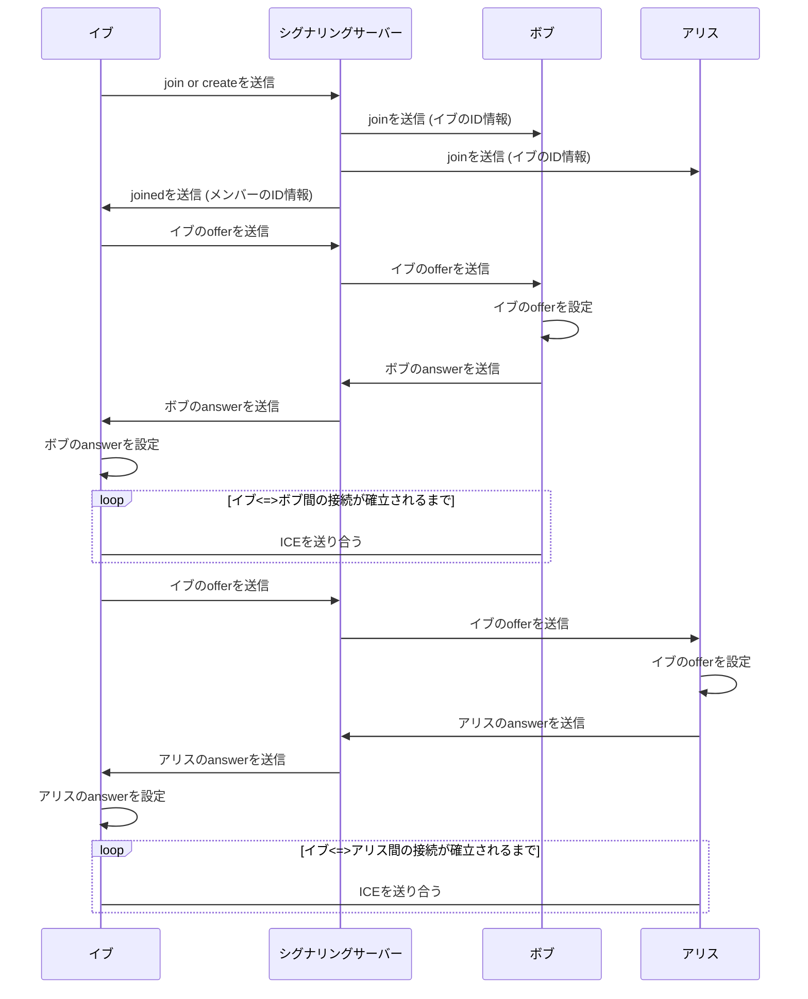

## 準備

今回作るアプリの雛形をダウンロードします。好きなディレクトリ下で以下のコマンドを実行してください。

```
$ git clone https://github.com/whtsht/webrtc-playground.git && cd webrtc-playground && git switch start
```

以下のようなフォルダ構成になっているはずです。

```
├── ap
├── LICENSE
├── README.md
└── web
```

ap フォルダにはサーバー側のコードが、web フォルダにはクライアント側のコードがあります。

### Web サーバーの起動

好きな Terminal を開いて以下を実行してください。

```
$ cd web
yarn を使う場合
$ yarn
$ yarn run dev
npm を使う場合
$ npm install
$ npm run dev
```

[http://localhost:5173](http://localhost:5173)で Web サーバーが起動するのでブラウザで開いてください。

### シグナリングサーバーの起動

Terminal をもう１つ開いて以下を実行してください。

```
$ cd ap
yarn を使う場合
$ yarn
$ yarn run dev
npm を使う場合
$ npm install
$ npm run dev
```

### 既存ファイルの説明

このリポジトリには、作業を減らすために、既にいくつかの typescript ファイルや svelte コンポーネントが存在します。

-   web/src/lib/Modal.svelte
    ポップアップの表示に使います。このアプリでは確認画面、ビデオ通話画面、ゲーム画面などに多用しています。
-   web/src/lib/SideBar.svelte
    部屋入室ボタン、退室ボタン、自分の ID や部屋のメンバーの ID を表示するためのサイドバーです。
-   web/src/lib/SpeechBubble.svelte
    チャットの吹き出しを表示するためのコンポーネントです。
-   web/src/lib/Snackbar.svelte
    システムメッセージを表示するためのコンポーネントです。任意のメッセージを表示でき、2 秒後に自動的に消えます。
-   web/src/lib/NewRoom.svelte, web/src/lib/LeaveRoom.svelte
    部屋の入室、退室を行うための画面です。
-   web/src/webrtc.ts
    WebRTC API の薄いラッパーです。
    -   `PeerConnection`
        他メンバーとの接続を管理するためのインターフェースです。
    -   `SendSdp`
        他メンバーに SDP を送信するための関数を表す型です。
    -   `sendOffer`
        オファーを送るための関数です。
    -   `setOffer`
        送られてきたオファーをセットする関数です。
    -   `sendAnswer`
        アンサーを送るための関数です。
    -   `setAnswer`
        送られてきたアンサーをセットする関数です。
-   web/src/chat.ts
    この章で作るチャットアプリの雛形です。

## socket.io の使い方

クライアントとの通信には socket.io という WebSocket のライブラリを使います。そのため socket.io の基礎的な使い方を説明します。

-   `io.on` : クライアントからの接続を待ち受けます。

```typescript
// クライアントからの接続を待ち受ける。
io.on("connection", (socket) => {
    console.log(`${socket.id}と接続しました`);
});
```

`socket.id`はクライアントの識別子です。今回作るアプリではこれをユーザーの名前としてそのまま使うことにします。

`${...}`のような書き方がありますが、これはテンプレートリテラルという機能です。テンプレートリテラルを使うと、文字列の中に変数を埋め込むことができます。

https://developer.mozilla.org/en-US/docs/Web/JavaScript/Guide/Text_formatting#multi-line_template_literals

-   `socket.on` : クライアントからのメッセージを待ち受けます。

```typescript
io.on("connection", (socket) => {
    // クライアントから"greeting"という名前のメッセージを待ち受ける。
    socket.on("greeting", (message: string) => {
        // 受け取ったメッセージを表示する。
        console.log(message);
    });
});
```

`message`は任意のオブジェクトを受け取ることができます。また複数の引数を受け取ることもできます。

-   `socket.emit` : クライアントにメッセージを送信します。

```typescript
io.on("connection", (socket) => {
    // クライアントから"greeting"という名前のメッセージを待ち受ける。
    socket.on("greeting", (message: string) => {
        // クライアントからのメッセージをそのまま返す(echoサーバー)。
        socket.emit("greeting", message);
    });
});
```

-   `io.sockets.emit` : 接続しているクライアント全員にメッセージを送信します。

```typescript
io.on("connection", (socket) => {
    // クライアントから"greeting"という名前のメッセージを待ち受ける。
    socket.on("greeting", (message: string) => {
        // 接続しているクライアント全員にメッセージを送信する。
        io.sockets.emit(`greeting from ${socket.id}: ${message}`, message);
    });
});
```

socket.io にはルームという機能があります。ルームに参加しているクライアントにだけメッセージを送信することができます。

-   `io.join` : クライアントをルームに参加させます。

```typescript
io.on("connection", (socket) => {
    // クライアントから"join"という名前のメッセージを待ち受ける。
    socket.on("join", (roomName: string) => {
        // クライアントをルームに参加させる。
        socket.join(roomName);
    });
});
```

-   `io.in(roomName).emit` : ルームに参加しているクライアント全員にメッセージを送信します。

```typescript
io.on("connection", (socket) => {
    // クライアントから"message"という名前のメッセージを待ち受ける。
    socket.on("message", (roomName: string, message: string) => {
        // ルームに参加しているクライアント全員にメッセージを送信する。
        io.in(roomName).emit("message", message);
    });
});
```

## 入室処理

### サーバー側

いよいよコーディングを始めます。まず入室処理を書いてみましょう。ap/src/app.ts を開いてください。

```typescript:ap/src/app.ts
import { Server } from "http";
import { Server as SocketIO } from "socket.io";

const httpServer = new Server();

const io = new SocketIO(httpServer, {
    cors: {
        origin: "http://localhost:5173",
        methods: ["GET", "POST"],
    },
});

httpServer.listen(8080);
```

HTTP サーバーと socket.io の初期化処理が書いてあります。クライアントのウェブサーバーと接続できるように CORS を設定しています。

https://javascript.keicode.com/newjs/what-is-cors.php

今回は最大 4 人までのチャット部屋を作成できるようにします。従って以下のような処理が必要になります。

-   もし部屋が存在しなければ、新しく部屋を作成する。
-   もし部屋が存在するならば
    -   人数が 4 人未満ならば、部屋に参加させる。
    -   人数が 4 人ならば、エラーを返す。

ちなみに 4 人という数字は勘で決めました。

```diff typescript:ap/src/app.ts
...

const io = new SocketIO(httpServer, {
    cors: {
        origin: "http://localhost:5173",
        methods: ["GET", "POST"],
    },
});

+    const membersMap: Map<string, string[]> = new Map();

httpServer.listen(8080);
```

メンバーの情報を保存するための Map を作成します。

その下に以下のような処理を書きます。

```diff typescript:ap/src/app.ts
...

+ io.on("connection", (socket) => {
      // デバッグ用
+     console.log("user connected");
+     socket.on("disconnect", () => {
+         console.log("user disconnected");
+     });
+
      // 入室処理
+     socket.on("create or join", (room: string) => {
+         const numMembers = membersMap.get(room)?.length ?? 0;
+
+         if (numMembers === 0) {
+             socket.join(room);
+             socket.emit("created");
+             membersMap.set(room, [socket.id]);
+         } else if (numMembers < 4) {
+             io.sockets.in(room).emit("join", socket.id);
+             socket.join(room);
+             socket.emit("joined", membersMap.get(room));
+             io.sockets.in(room).emit("ready");
+             membersMap.set(room, [...membersMap.get(room)!, socket.id]);
+         } else {
+             socket.emit("full", room);
+         }
+     });
+ });

httpServer.listen(8080);
```

`create or join`という名前のメッセージを待ち受けるようにします。部屋を作成する場合は`created`という名前のメッセージを返します。部屋に参加する場合は`joined`という名前のメッセージを返し、部屋に参加しているメンバーの ID を送信します。メンバーの ID は SDP を送るときなどに使用します。もし部屋が満員ならば`full`という名前のメッセージを返します。

### クライアント側

web/src/chat.ts を開いてください。アプリ間で共有する変数と socket.io の初期化処理が書いてあります。ここに入室処理を書いていきます。

```diff typescript:web/src/chat.ts
export function createOrJoinRoom(name: string) {
-    throw new Error("Not implemented");
+    return new Promise((resolve, reject) => {
+        let timer: null | NodeJS.Timeout = null;
+        if (!connected) {
+            reject("not connected");
+        }
+
+        socket.emit("create or join", name);
+
+        socket.once("full", (room: string) => {
+            if (timer) clearTimeout(timer);
+            reject(`room ${room} is full`);
+        });
+
+        socket.once("created", () => {
+            if (timer) clearTimeout(timer);
+            roomName.set(name);
+            resolve("created");
+        });
+
+        socket.once("joined", async (members: string[]) => {
+            if (timer) clearTimeout(timer);
+            for (const member of members) {
+                await sendOffer(newPeerConnection, member, sendSdp);
+            }
+
+            resolve("joined");
+        });
+
+        timer = setTimeout(() => {
+            reject("timeout waiting for message");
+        }, timeout);
+    });
}
```

引数の`name`は部屋の名前です。`socket.emit`で`create or join`という名前のメッセージを送信します。
この関数はプロミスを返します。プロミスとは非同期処理の結果を表すオブジェクトです。`resolve`と`reject`という関数を引数に取ります。`resolve`は処理が成功した場合に呼び出します。`reject`は処理が失敗した場合に呼び出します。

https://qiita.com/cheez921/items/41b744e4e002b966391a

`socket.once`は一度だけメッセージを待ち受けます。`created`という名前のメッセージを受け取ったら部屋名を設定して`resolve`を呼び出します。`joined`という名前のメッセージを受け取ったらメンバーの ID を取得して `sendOffer`を呼び出します。
`full`という名前のメッセージを受け取るか、タイマーがタイムアウトしたらエラーなので`reject`を呼び出します。

## シグナリング

部屋に入室した場合、メンバーの ID を取得しましたね。この ID を使って 1 人ずつ順番に接続していきます。

例えばボブ、アリス がいる部屋名 A にイブ が入室する場合は以下のような処理になります。



イメージとしては新しく引っ越してきた人が、隣の家に挨拶に行くような感じです。

それでは実装しましょう！

### サーバー側

サーバー側は受け取った SDP をそのまま他メンバーに送信するだけです。

```diff typescript:ap/src/app.ts
...

io.on("connection", (socket) => {
    ...

+     socket.on(
+         "offer",
+         (room: string, to: string, from: string, sdp: string) => {
+             io.sockets.in(room).emit("offer", to, from, sdp);
+         }
+     );
+
+     socket.on(
+         "answer",
+         (room: string, to: string, from: string, sdp: string) => {
+             io.sockets.in(room).emit("answer", to, from, sdp);
+         }
+     );
+
+     socket.on(
+         "candidate",
+         (room: string, to: string, from: string, candidate: string) => {
+             io.sockets.in(room).emit("candidate", to, from, candidate);
+         }
+     );
});

httpServer.listen(8080);
```

### クライアント側

SDP を送る関数を定義します。socket.io の`emit`関数を使ってサーバーに送信します。`JSON.stringify`はオブジェクトを JSON 形式の文字列に変換する関数です。

```diff typescript:web/src/chat.ts
function sendSdp(
    type: "offer" | "answer",
    sdp: RTCSessionDescription,
    to: string,
    from: string
) {
-    throw new Error("Not implemented");
+    socket.emit(type, get(roomName), to, from, JSON.stringify(sdp));
}
```

新しい接続を作成する関数を定義します。WebRTC の接続は`RTCPeerConnection`というクラスで管理します。

https://developer.mozilla.org/en-US/docs/Web/API/RTCPeerConnection

注意しなればならないのは`RTCPeerConnection`はメンバーの数だけ準備する必要があるということです。


白い四角がユーザー、色付きの四角が`RTCPeerConnection`を表しています。

新しく作った接続にイベント処理を追加していきます。

```diff typescript:web/src/chat.ts
function newPeerConnection(to: string): RTCPeerConnection {
-    throw new Error("Not implemented");
+    const peer = new RTCPeerConnection();

+    peer.onconnectionstatechange = (_) => {
         // 接続状態が変化したらログを出力する。
+        console.log(`connection state: ${peer.connectionState}`);
+        if (peer.connectionState === "connected") {
             // 接続されたら`chatMembers`に追加する。
+            chatMembers.update((members) => [...members, to]);
+        } else if (
+            peer.connectionState === "disconnected" ||
+            peer.connectionState === "failed" ||
+            peer.connectionState === "closed"
+        ) {
             // 接続が切れたら`chatMembers`から削除する。
+            chatMembers.update((members) =>
+                members.filter((member) => member !== to)
+            );
+        }
+    };
+
     // リモートからのチャネルを受け取ったら`chatChannel`に設定する。
+    peer.ondatachannel = (ev) => {
+        const { chatConnection } = connects.get(to)!;
+        connects.set(to, {
+            chatConnection,
+            chatChannel: ev.channel,
+        });
+    };
+
     // chatチャネルを作成する。
+    const chatChannel = peer.createDataChannel("chat");
     // chatチャネルにメッセージが届いたら`chatMessages`に追加する。
+    chatChannel.onmessage = (ev) => {
+        const message: ChatMessage = JSON.parse(ev.data);
+        console.log(message);
+        chatMessages.update((messages) => {
+            return [...messages, message];
+        });
+    };
+
     // ICE の候補を取得したら相手に送信する。
+    peer.onicecandidate = (ev) => {
+        if (ev.candidate) {
+            console.log(ev.candidate);
+            sendCandidate(ev.candidate, to, socket.id);
+        }
+    };
+
     // 接続を保存する。
+    connects.set(to, {
+        chatConnection: peer,
+        chatChannel,
+    });
+
+    return peer;
}
```

途中で`chatChannel`を作っていますね。これはチャットのメッセージを送受信するためのチャネルです。WebRTC はメッセージを送受信するためにチャネルを作成する必要があります。

新しい接続を`connects`変数に格納しました。今後はこの`connects`変数を使って接続を取得します。
`connects`変数を直接使うのは面倒なので`getPeer`という関数を定義しておきます。

```diff typescript:web/src/chat.ts
function getPeer(to: string): RTCPeerConnection {
-    throw new Error("Not implemented");
+    return connects.get(to)!.chatConnection!;
}
```

ICE の候補を送信する関数を定義します。これは SDP を送信する関数とほぼ同じです。

```diff typescript:web/src/chat.ts
function sendCandidate(candidate: RTCIceCandidate, to: string, from: string) {
-    throw new Error("Not implemented");
+    socket.emit(
+        "candidate",
+        get(roomName),
+        to,
+        from,
+        JSON.stringify(candidate)
+    );
}
```

メッセージを送信する関数を定義します。先程作った`chatChannel`を使います。

```diff typescript:web/src/chat.ts
export function sendMessage(message: ChatMessage) {
-    throw new Error("Not implemented");
+    connects.forEach(({ chatConnection: _, chatChannel }) => {
         try {
             chatChannel.send(JSON.stringify(message));
         } catch (_) {}
     });
}
```

相手の接続が閉じた状態だと`chatChannel.send`が例外を投げるので、`try`で囲って無視しています。

次にシグナリングサーバーからのメッセージを受け取る処理を書きます。

```diff typescript:web/src/chat.ts
...
-    socket.on("connect", () => {});
+    socket.on("connect", () => {
+        connected = true;
         // ユーザ名を設定する。
+        userName.set(socket.id);
+
         // joinメッセージを受け取ったら新しくPeerConnectionを作成する。
+        socket.on("join", async (from: string) => {
+            newPeerConnection(from);
+        });
+
         // offerを受け取ったら自分のSDPを設定し、answerを返す。
+        socket.on("offer", async (to: string, from: string, sdp: string) => {
+            if (to !== socket.id) return;
+            console.log(`[chat offer] to: ${to}, from: ${from}, sdp: ${sdp}`);
+            const peer = getPeer(from);
+
+            await setOffer(peer, JSON.parse(sdp));
+            await sendAnswer(peer, from, sendSdp);
+        });
+
         // answerを受け取ったら自分のSDPを設定する。
+        socket.on("answer", async (to: string, from: string, sdp: string) => {
+            if (to !== socket.id) return;
+            console.log(`[chat answer] to: ${to}, from: ${from}, sdp: ${sdp}`);
+            const peer = getPeer(from);
+            await setAnswer(peer, JSON.parse(sdp));
+        });
+
         // candidateを受け取ったらICEの候補を設定する。
+        socket.on("candidate", (to: string, from: string, candidate: string) => {
+            if (to !== socket.id) return;
+            console.log(
+                `[chat candidate] to: ${to}, from: ${from}, candidate: ${candidate}`
+            );
+            getPeer(from).addIceCandidate(JSON.parse(candidate));
+        });
+    });
```

`if (to !== socket.id) return;`という処理がありますが、これは自分宛のメッセージでなければ無視するための処理です。

## メッセージ送信 UI

送信処理が書けたので、ユーザーインターフェースを作っていきます。

```diff typescript:web/src/lib/Chat/Sender.svelte
 <script lang="ts">
+    import { chatMessages, roomName, sendMessage, userName } from "../../chat";
+    import Send from "svelte-material-icons/Send.svelte";
+
+    let value = "";
+
+    function sendChatMessage() {
+        if (value !== "" && $roomName && $userName) {
+            chatMessages.update((messages) => [
+                ...messages,
+                { user: $userName, type: "chat", message: value },
+            ]);
+            sendMessage({ type: "chat", message: value, user: $userName });
+        }
+        value = "";
+    }
+
     // テキストボックスにフォーカスがある状態でShift+Enterを押すとメッセージを送信する。
+    function handleKeyboard(event: KeyboardEvent) {
+        if (event.shiftKey && event.key === "Enter") {
+            event.preventDefault();
+            sendChatMessage();
+        }
+    }
 </script>

- <div class="sender" />
+ <div class="sender">
+     <textarea bind:value on:keydown={handleKeyboard} />
+     <button on:click={sendChatMessage}>
+         <Send size="24px" viewBox="0 0 24 20" />
+     </button>
+ </div>

 <style>
     ...
+    .sender textarea {
+        width: 100%;
+        height: 50px;
+        resize: none;
+    }
+
+    .sender button {
+        height: 50px;
+        border: solid 2px;
+        background-color: #f1f1f1;
+    }
+
+    .sender button:hover {
+        height: 50px;
+        border: solid 2px;
+        background-color: #555;
+    }
 </style>
```

メッセージを入力するテキストボックスと、メッセージを送信するボタンを作りました。

## メッセージ表示 UI

最後にメッセージを表示する処理を書きます。
送信または受信したメッセージは`chatMessage`という変数に保存されています(Sender.svelte と chat.ts を確認してください)。これを each ブロックを使って表示させるだけです。

```diff typescript:web/src/lib/Chat/Main.svelte
 <script lang="ts">
+    import { fly } from "svelte/transition";
+    import { chatMessages } from "../../chat";
+    import ChatMessage from "./ChatMessage.svelte";
     import Sender from "./Sender.svelte";
 </script>

 <div class="chat">
-    <div class="message-box" />
+    <div class="message-box">
+        {#each $chatMessages as chat}
+            <div in:fly={{ y: 100, duration: 500 }}>
+                <ChatMessage user={chat.user} message={chat.message} />
+            </div>
+        {/each}
+    </div>
     <Sender />
 </div>

...
```

ここまで書けたらもうチャット機能は使えるはずです。ブラウザのウィンドウを 2 つ以上開いて、同じ部屋に入室してみてください。


## まとめ

チャットアプリの実装ができました。これからのビデオ通話も Pong ゲームもここまでのコードをベースにしていきます。なので、このコードを理解することは大切です。順番に実行手順、送信されるメッセージを追っていくと理解しやすいと思います。
