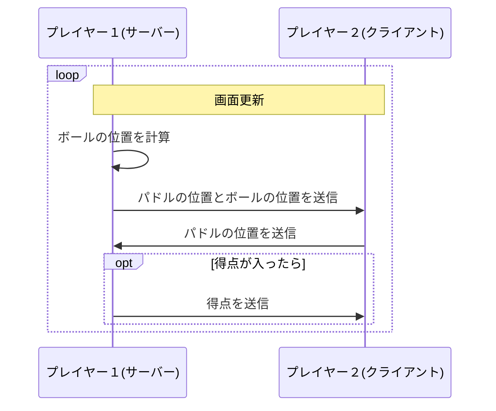

## 準備

前の章で作ったチャットアプリをさらに拡張して、Pong ゲーム機能を追加しましょう！

Pong ゲームはアタリが作った卓球を模したゲームです。

https://ja.wikipedia.org/wiki/%E3%83%9D%E3%83%B3_(%E3%82%B2%E3%83%BC%E3%83%A0)

これもボールや得点を管理するサーバーは作らず、P2P 通信を使って実装していきます。

もしこの章からコーディングしたい場合は好きなディレクトリ下で以下のコマンドを実行してください。

```
$ git clone https://github.com/whtsht/webrtc-playground.git && cd webrtc-playground && git switch video
```

## 設計

Pong ゲームではプレイヤーは 2 人で、それぞれがボールを打ち合って得点を競います。ボールを打ち返すバーのことをパドルと呼びます。

お互いがパドルの場所を送信し合うのは間違いなさそうです。しかしボールは 1 ゲームに 1 つしかありません。なのでボールの挙動をどちらか一方のプレイヤーに任せ、もう一方のプレイヤーはボールの位置を受け取って描画するだけにするのが妥当でしょう。便宜上、ボールの挙動を管理するプレイヤーをサーバー、ボールの位置を受け取って描画するプレイヤーをクライアントと呼ぶことにします。ゲームを始めた側がサーバーになるようにします。ゲームに参加した側はクライアントにします。



処理の流れは以下のようになります。

### ゲームを始める側(サーバー)

1. ユーザーがゲーム開始ボタンを押す
2. 他のメンバーにゲーム招待メッセージを送信する
3. ゲーム画面を開く
4. クライアントから`join`メッセージを受け取る
5. 相手がすでにいる場合は`full`メッセージを送信する、いない場合は`joined`メッセージを送信する
6. 相手から`start`メッセージを受け取る

### ゲームに参加する側(クライアント)

1. ゲーム招待メッセージを受け取る
2. ユーザーがゲーム招待メッセージの Join ボタンを押す
3. サーバーに`join`メッセージを送信する
4. サーバーから`joined`メッセージを受け取る
5. サーバーに`start`メッセージを送信する
6. ゲーム画面を開く

## ゲームの状態を送信する

ゲームの状態を送信するために新たに`pongChannel`を作ります。

```diff typescript:web/src/webrtc.ts
...

 interface PeerConnection {
     chatConnection: RTCPeerConnection;
     videoCallConnection: RTCPeerConnection | null;
     chatChannel: RTCDataChannel;
     negotiateChannel: RTCDataChannel;
+    pongChannel: RTCDataChannel;
 }

...
```

Pong ゲームのデータ送信処理を書いていきます。web/src/pong.ts ファイルを作ってください。

```typescript:web/src/pong.ts
import { get, writable, type Writable } from "svelte/store";
import { connects } from "./webrtc";
import { userName } from "./chat";
import { open } from "./lib/Snackbar.svelte";

// ゲーム画面を表示するかどうか
export const display = writable(true);

// 相手の名前
export const opponent: Writable<null | string> = writable(null);

// 相手が準備完了したかどうか
export const opponentReady: Writable<boolean> = writable(false);

// 自分のパドルの位置
export const opponentPosition = writable(0);

// ボールの位置
export const ballPosition = writable({ x: 0, y: 0 });

// 得点
export const score = writable({ my: 0, opponent: 0 });

// サーバーかどうか
export const isServer = writable(false);

type Message =
    // ゲームの参加要求 クライアント -> サーバー
    | { type: "join"; from: string }
    // 既にメンバーが揃っていて参加できない サーバー -> クライアント
    | { type: "full" }
    // ゲームに参加できる サーバー -> クライアント
    | { type: "joined"; from: string }
    // ゲーム参加 クライアント -> サーバー
    | { type: "start"; from: string }
    // パドルの位置 クライアント -> サーバー
    | { type: "position"; y: number }
    // パドルの位置とボールの位置 サーバー -> クライアント
    | { type: "position and ball"; y: number; ball: { x: number; y: number } }
    // 得点 サーバー -> クライアント
    | { type: "score"; score: { my: number; opponent: number } }
    // ゲーム終了 サーバー <-> クライアント
    | { type: "exit" };

export function createPongChannel(peer: RTCPeerConnection) {
    const channel = peer.createDataChannel("pong");

    channel.onmessage = (ev) => {
        const message: Message = JSON.parse(ev.data);
        if (message.type === "join") {
            if (get(opponent)) {
                sendMessage(message.from, { type: "full" });
            } else {
                isServer.set(true);
                sendMessage(message.from, {
                    type: "joined",
                    from: get(userName),
                });
            }
        } else if (message.type === "start") {
            opponent.set(message.from);
        } else if (message.type === "joined") {
            isServer.set(false);
            opponent.set(message.from);
            sendMessage(message.from, { type: "start", from: get(userName) });
        } else if (message.type === "position") {
            opponentPosition.set(message.y);
        } else if (message.type === "position and ball") {
            opponentPosition.set(message.y);
            ballPosition.set(message.ball);
        } else if (message.type === "score") {
            score.set(message.score);
        } else if (message.type === "exit") {
            opponent.set(null);
            display.set(false);
        } else if (message.type === "full") {
            open("Some people are already playing");
        }
    };

    return channel;
}

function sendMessage(to: string, message: Message) {
    const connect = connects.get(to)!;
    connect.pongChannel.send(JSON.stringify(message));
}

export function joinGame(to: string) {
    sendMessage(to, { type: "join", from: get(userName) });
}

export function sendPosition(y: number) {
    sendMessage(get(opponent)!, { type: "position", y });
}

export function sendPositionAndBall(y: number, ball: { x: number; y: number }) {
    sendMessage(get(opponent)!, { type: "position and ball", y, ball });
}

export function sendScore(score: { my: number; opponent: number }) {
    sendMessage(get(opponent)!, {
        type: "score",
        score: { my: score.opponent, opponent: score.my },
    });
}

export function sendExit() {
    sendMessage(get(opponent)!, { type: "exit" });
}

```

## ゲーム画面実装

いよいよゲーム画面を実装します。web/src/lib/Pong.svelte ファイルを作ってください。

```typescript:web/src/lib/Pong.svelte
<script lang="ts">
    import {
        ballPosition,
        display,
        isServer,
        opponent,
        opponentPosition,
        score,
        sendExit,
        sendPosition,
        sendPositionAndBall,
        sendScore,
    } from "../pong";
    import Modal from "./Modal.svelte";
    let screen: HTMLElement | null = null;

    let myPosition = 0;
    let opPosition = 0;

    let ballVelocity = { x: 0, y: 0 };

    let myPaddle: HTMLElement | null = null;
    let opPaddle: HTMLElement | null = null;
    let ball: HTMLElement | null = null;

    // ゲームの初期化
    function restart() {
        // クライアント側は何もしない
        if (!$isServer) return;

        const getRandomInt = (max: number) => {
            return Math.floor(Math.random() * max);
        };

        // ボールの初期化
        $ballPosition.x = screen!.clientWidth / 2 - ball!.clientWidth / 2;
        $ballPosition.y = screen!.clientHeight / 2 - ball!.clientHeight / 2;
        ballVelocity.x = 0;
        ballVelocity.y = 0;

        // ボールの速度をランダムに決める
        setTimeout(() => {
            ballVelocity.y = Math.random() * 2;
            ballVelocity.x = (getRandomInt(2) - 0.5) * 6;
        }, 1000);
    }

    // スクリーン上の要素の位置を変更する
    function updateScreen() {
        myPaddle!.style.top = myPosition + "px";
        opPaddle!.style.top = opPosition + "px";
        ball!.style.top = $ballPosition.y + "px";

        if ($isServer) {
            ball!.style.left = $ballPosition.x + "px";
        } else {
            ball!.style.right = $ballPosition.x + "px";
        }
    }

    function updateClient() {
        updateScreen();
        sendPosition(myPosition);
    }

    function updateServer() {
        updateScreen();

        $ballPosition.x += ballVelocity.x;
        $ballPosition.y += ballVelocity.y;

        // 相手のパドルにボールが当たったときの処理
        if (
            $ballPosition.x >
                screen!.clientWidth -
                    ball!.clientWidth -
                    opPaddle!.clientWidth &&
            opPosition < $ballPosition.y + myPaddle!.clientWidth &&
            $ballPosition.y < opPosition + opPaddle!.clientHeight
        ) {
            ballVelocity.x *= -1.05;
            $ballPosition.x =
                screen!.clientWidth - ball!.clientWidth - opPaddle!.clientWidth;
        }

        // 自分のパドルにボールが当たったときの処理
        if (
            $ballPosition.x < 0 + myPaddle!.clientWidth &&
            myPosition < $ballPosition.y + ball!.clientWidth &&
            $ballPosition.y < myPosition + myPaddle!.clientHeight
        ) {
            ballVelocity.x *= -1.05;
            $ballPosition.x = myPaddle!.clientWidth;
        }

        // 上下に跳ね返る処理
        if (
            $ballPosition.y > screen!.clientHeight - ball!.clientHeight ||
            $ballPosition.y < 0
        ) {
            ballVelocity.y *= -1;
        }

        // 自分に得点が入ったときの処理
        if ($ballPosition.x > screen!.clientWidth - ball!.clientWidth) {
            $score.my += 1;
            sendScore($score);
            restart();
        }

        // 相手に得点が入ったときの処理
        if ($ballPosition.x < 0) {
            $score.opponent += 1;
            sendScore($score);
            restart();
        }

        sendPositionAndBall(myPosition, $ballPosition);
    }

    function update() {
        if ($opponent) {
            if ($isServer) {
                updateServer();
            } else {
                updateClient();
            }
        }
        requestAnimationFrame(update);
    }
    requestAnimationFrame(update);

    document.onmousemove = (ev) => {
        myPosition += ev.movementY;
        if (myPosition < 0) myPosition = 0;

        const height = screen!.clientHeight - myPaddle!.clientHeight;
        if (myPosition > height) myPosition = height;
    };

    $: $opponent,
        (() => {
            if ($opponent) {
                $display = true;
                restart();
            } else {
                $score.my = 0;
                $score.opponent = 0;
                $display = false;
            }
        })();
    $: $opponentPosition, (opPosition = $opponentPosition);
</script>

<Modal display={$display}>
    <div class="pong" bind:this={screen}>
        <div class="paddle left" bind:this={myPaddle} />
        <div class="paddle right" bind:this={opPaddle} />

        <div class="ball" bind:this={ball} />

        <div class="line" />

        <p class="score left">{$score.my}</p>
        <p class="score right">{$score.opponent}</p>
    </div>

    <div style="height: 2vh;" />

    <button
        on:click={() => {
            if ($opponent) sendExit();
            $opponent = null;
            $display = false;
        }}>Exit</button
    >
</Modal>

<style>
    .pong {
        width: 70vmax;
        height: 35vmax;
        padding: 0;
        margin: 0;
        background-color: black;
    }

    .paddle {
        width: 2vmax;
        height: 8vmax;
        background-color: #fff;
        position: absolute;
    }

    .paddle.left {
        left: 0;
        position: absolute;
    }

    .paddle.right {
        right: 0;
        position: absolute;
    }

    .ball {
        background-color: #fff;
        width: 3vmax;
        height: 3vmax;
        border-radius: 50%;
        position: absolute;
    }

    .line {
        position: absolute;
        left: 50%;
        transform: translateX(-50%);
        width: 0.5vmax;
        height: 35vmax;
        background-color: #fff;
    }

    .score {
        color: #fff;
        position: absolute;
        font-size: 4vmax;
    }

    .score.left {
        left: 23%;
    }

    .score.right {
        right: 23%;
    }
</style>
```

`$: xxx, ~~~`は変数 xxx が更新されたら処理~~~を実行するという意味になります。
`$: $opponent,`の部分で相手がいる場合は画面を表示してゲームを開始します。いない場合は画面を非表示にします。`$: $opponentPosition, (opPosition = $opponentPosition);`の部分で相手のパドルの位置を更新します。

`<yyy bind:this={xxx}></yyy>`は yyy という DOM 要素に変数 xxx を束縛するという意味になります。

パドルの当たり判定処理がとんでもないことになっていますが、ご容赦ください。

ゲームの勝敗判定は行っていません。Exit ボタンを押し次第、ゲームは終了します。

次に chat.ts に`pongChannel`を追加します。

```diff typescript:web/src/chat.ts
 import { connect } from "socket.io-client";
 import { get, writable, type Writable } from "svelte/store";
 import { createNegotiationChannel } from "./videoCall";
+ import { createPongChannel } from "./pong"
 import { connects, sendAnswer, sendOffer, setAnswer, setOffer } from "./webrtc";

...

 function newPeerConnection(to: string): RTCPeerConnection {
     const peer = new RTCPeerConnection();
     peer.onconnectionstatechange = (_) => {
         console.log(`connection state: ${peer.connectionState}`);
         if (peer.connectionState === "connected") {
             chatMembers.update((members) => [...members, to]);
         } else if (
             peer.connectionState === "disconnected" ||
             peer.connectionState === "failed" ||
             peer.connectionState === "closed"
         ) {
             chatMembers.update((members) =>
                 members.filter((member) => member !== to)
             );
         }
     };

     peer.ondatachannel = (ev) => {
         const {
             chatConnection,
             videoCallConnection,
             chatChannel,
             negotiateChannel,
+            pongChannel,
         } = connects.get(to)!;
         if (ev.channel.label == "chat") {
             connects.set(to, {
                 chatConnection,
                 videoCallConnection,
                 chatChannel: ev.channel,
                 negotiateChannel,
+                pongChannel,
             });
-        } else {
+        } else if (ev.channel.label == "negotiate") {
             connects.set(to, {
                 chatConnection,
                 videoCallConnection,
                 chatChannel,
                 negotiateChannel: ev.channel,
+                pongChannel,
+            });
+        } else {
+            connects.set(to, {
+                chatConnection,
+                videoCallConnection,
+                chatChannel,
+                negotiateChannel,
+                pongChannel: ev.channel,
             });
         }
     };

     const chatChannel = peer.createDataChannel("chat");
     chatChannel.onmessage = (ev) => {
         const message: ChatMessage = JSON.parse(ev.data);
         console.log(message);
         chatMessages.update((messages) => {
             return [...messages, message];
         });
     };

     const negotiateChannel = createNegotiationChannel(peer);

+    const pongChannel = createPongChannel(peer);
+
     peer.onicecandidate = (ev) => {
         if (ev.candidate) {
             console.log(ev.candidate);
             sendCandidate(ev.candidate, to, socket.id);
         }
     };

     connects.set(to, {
         chatConnection: peer,
         videoCallConnection: null,
         chatChannel,
         negotiateChannel,
+        pongChannel,
     });

     return peer;
 }
```

## ゲーム招待メッセージ

前章でビデオ通話招待メッセージを作ったときのようにゲーム招待メッセージを作ります。

```diff typescript:web/src/chat.ts
import { connect } from "socket.io-client";
import { get, writable, type Writable } from "svelte/store";
import { createNegotiationChannel } from "./videoCall";
import { createPongChannel } from "./pong";
import { connects, sendAnswer, sendOffer, setAnswer, setOffer } from "./webrtc";

export const roomName: Writable<null | string> = writable(null);

export const userName = writable("");

export const chatMembers: Writable<string[]> = writable([]);

export type ChatMessage =
    | { user: string; type: "chat"; message: string }
-   | { user: string; type: "videoCall" };
+   | { user: string; type: "videoCall" }
+   | { user: string; type: "pong" };

...
```

新たに web/src/lib/Chat/PongMessage.svelte ファイルを作ってください。

```typescript:web/src/lib/Chat/PongMessage.svelte
<script lang="ts">
    import { userName } from "../../chat";
    import { joinGame } from "../../pong";
    import SpeechBubble from "../SpeechBubble.svelte";
    export let user: string;
</script>

<SpeechBubble name={user}>
    <p>Let's start pong game!</p>
    {#if user !== $userName}
        <button
            style="margin-bottom: 20px;"
            on:click={() => {
                joinGame(user);
            }}>Join</button
        >
    {/if}
</SpeechBubble>
```

ゲーム招待メッセージ送信ボタンを作ります。Sender.svelte を以下のように変更してください。

```diff typescript:web/src/lib/Chat/Sender.svelte
+    import Controller from "svelte-material-icons/Controller.svelte";
+    import { display as displayPong } from "../../pong";

...

+    function startGame() {
+        if ($roomName) {
+            chatMessages.update((messages) => [
+                ...messages,
+                { user: $userName, type: "pong" },
+            ]);
+            sendMessage({ type: "pong", user: $userName });
+            $displayPong = true;
+        }
+    }

...

 <div class="sender">
     <textarea bind:value on:keydown={handleKeyboard} />
     <button on:click={sendChatMessage}>
         <Send size="24px" viewBox="0 0 24 20" />
     </button>
     <button on:click={startVideoCall}>
         <Phone size="24px" viewBox="0 0 24 20" />
     </button>
+    <button on:click={startGame}>
+        <Controller size="24px" viewBox="0 0 24 20" />
+    </button>
 </div>
```

ゲーム招待メッセージを表示できるようにします。

```diff typescript:web/src/lib/Chat/Main.svelte
 <script lang="ts">
     import { fly } from "svelte/transition";
     import { chatMessages } from "../../chat";
     import VideoCallMessage from "./VideoCallMessage.svelte";
+    import PongMessage from "./PongMessage.svelte";
     import ChatMessage from "./ChatMessage.svelte";
     import Sender from "./Sender.svelte";
 </script>

 <div class="chat">
     <div class="message-box">
         {#each $chatMessages as chat}
             <div in:fly={{ y: 100, duration: 500 }}>
                 {#if chat.type === "chat"}
                     <ChatMessage user={chat.user} message={chat.message} />
-                {:else}
+                {:else if chat.type === "videoCall"}
                     <VideoCallMessage user={chat.user} />
+                {:else}
+                    <PongMessage user={chat.user} />
                 {/if}
             </div>
         {/each}
     </div>
     <Sender />
 </div>

...
```

最後にゲーム画面を表示するために `App.svelte` を以下のように変更します。

```diff typescript:web/src/App.svelte
 <script lang="ts">
     import Chat from "./lib/Chat/Main.svelte";
+    import Pong from "./lib/Pong.svelte";
     import SideBar from "./lib/SideBar.svelte";
     import Snackbar from "./lib/Snackbar.svelte";
     import VideoCall from "./lib/VideoCall.svelte";
     import LeaveRoom from "./lib/LeaveRoom.svelte";
     import NewRoom from "./lib/NewRoom.svelte";

     let leaveRoom: LeaveRoom;
     let newRoom: NewRoom;
 </script>

 <main>
     <SideBar bind:leaveRoom bind:newRoom />
     <Chat />
     <VideoCall />
     <Snackbar />
+    <Pong />

     <LeaveRoom bind:this={leaveRoom} />
     <NewRoom bind:this={newRoom} />
 </main>
```

これで Pong ゲーム機能が追加されました。右下のコントローラーのボタンを押すとゲーム画面が表示されます。ゲームに参加する場合はゲーム招待メッセージを送信した相手の Join ボタンを押してください。


今は 1 人で動作のテストしてるだけなので味気ないですね。シグナリングサーバーを外部で公開して、STUN サーバーを用意して、離れた場所にいる友達と動作確認したら面白いと思います。余裕があればやってみてください。

https://html5experts.jp/mganeko/5554/

## まとめ

Pong ゲーム機能を追加しました。

ゲームの通信において、こうすれば絶対にうまくいくという方法はありません。
今回はボールを管理するプレイヤーを作りましたが、2 人のプレイヤーがそれぞれボールを管理することもできます。得点もそれぞれのプレイヤーが管理すれば、プレイヤーの役割分担は必要なくなります。しかし、ゲーム状態の整合性を保つのが難しくなります。このようにゲームを作るときはゲームの状態はどのように管理するか、通信する内容はどのようにするかを考える必要があります。私はこの過程が一番難しく、面白いところだと思っています。
